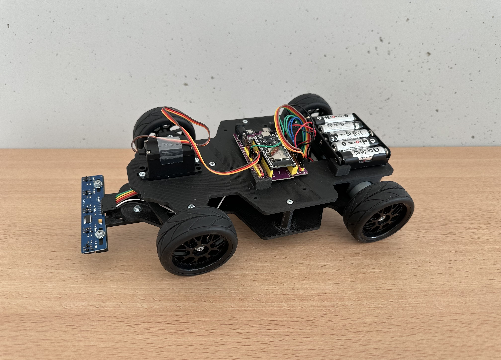
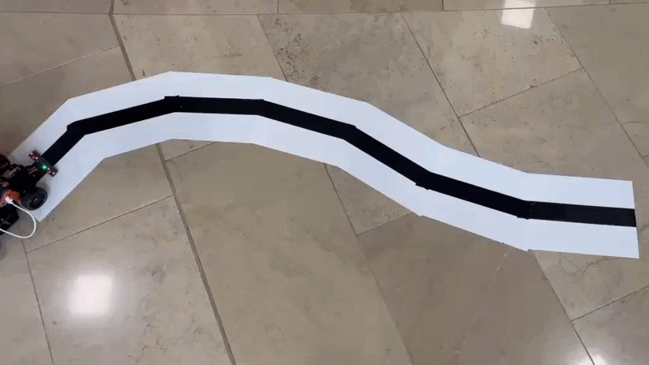
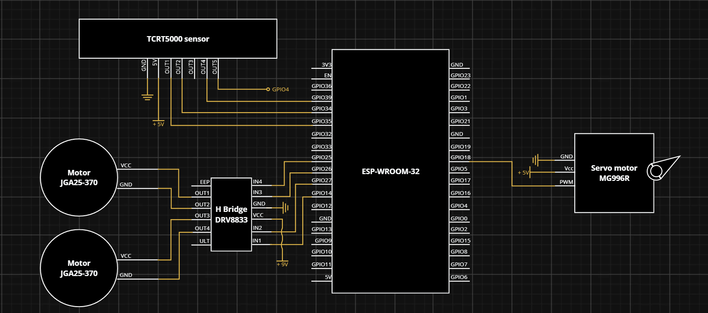
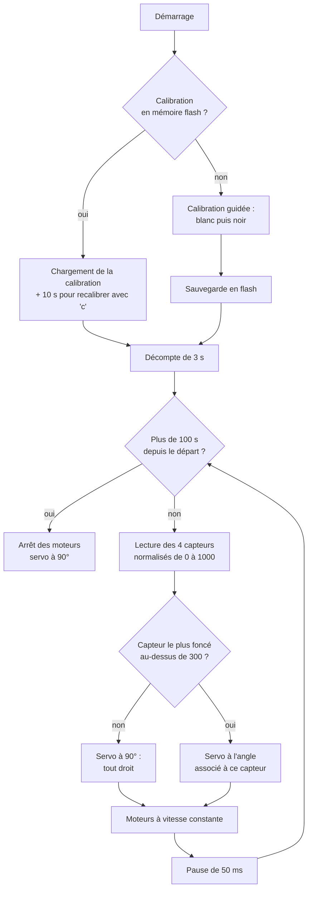

# 🏎️ Voiture autonome suiveuse de ligne (inspirée de la NXP Cup)




> Vue de profil de la voiture une fois l'assemblage mécanique et électronique terminé.
## 📖 Présentation

Ce projet a été réalisé dans le cadre du projet de 3<sup>e</sup> année à Polytech Dijon, en équipe de trois étudiants. Nous voulions monter en compétences en électronique embarquée, en programmation, et découvrir l'impression 3D. La NXP Cup nous a inspiré un objectif concret : construire une voiture autonome capable de suivre une ligne au sol.
 
La **NXP Cup** est une compétition internationale universitaire organisée par NXP Semiconductors, dans laquelle des équipes d'étudiants conçoivent, construisent et programment un véhicule miniature autonome qui parcourt un circuit le plus rapidement possible. Dans le kit officiel 2025-2026, la voiture est montée sur un châssis imprimé en 3D, pilotée par un microcontrolleur NXP et guidée par une caméra. Plus d'informations sur le [site officiel de la NXP Cup](https://nxpcup.nxp.com) et dans son [GitBook technique](https://nxp.gitbook.io/nxp-cup).
 
Plutôt que d'utiliser une carte NXP, nous avons choisi de relever le défi à notre manière : nous avons gardé la base mécanique du kit officiel (moteurs, servomoteur, roues, châssis imprimé en 3D à partir des fichiers de NXP que nous avons adaptés) et repensé le reste autour d'un **ESP32**.

## 👥 Équipe

Projet réalisé en équipe de trois, dans le cadre du projet d'année de 3ᵉ année à Polytech Dijon.

| Membre | LinkedIn |
|---|---|
| GUENIAT Anice | [linkedin.com/in/anice-guéniat](https://www.linkedin.com/in/anice-gu%C3%A9niat/) |
| PORTAZ-MONCAYOLA Théo | [linkedin.com/in/theo-portaz-moncayola](https://www.linkedin.com/in/theo-portaz-moncayola/) |
| TENA-FRANCIA Baptiste | [linkedin.com/in/baptiste-tenafrancia](https://www.linkedin.com/in/baptiste-tenafrancia/) |


## 🆚 NXP Cup officielle vs. Notre voiture

Nous avons conservé la base mécanique du kit officiel et remplacé les composants électroniques qui pilotent la voiture
 
| | Kit officiel (édition 2025-2026) | Notre voiture |
|---|---|---|
| Carte de contrôle | Carte NXP (FRDM-MCXN947, FRDM i.MX93 ou S32K144) | ESP32-DevKitC + carte d'extension |
| Détection de ligne | Caméra Pixy2 | 	Module de 5 capteurs infrarouges (TCRT5000) |
| Propulsion | 2 × moteurs JGA25-370 + pilotes DRV8833 | Identique |
| Direction | Servomoteur MG996R | Identique |
| Roues et guidage | Pneus 65 mm, coupleurs hexagonaux 12 mm, roulement 626ZZ | Identique |
| Alimentation | Batterie LiPo 2S + régulateurs LM2596 | Piles 5 × AA (moteurs) + batterie externe USB-C (électronique) |
| Châssis | Imprimé en 3D (fichiers publiés par NXP) | Impression 3D à partir des fichiers NXP adapté (voir ci-dessous) |
| Logiciel | Outils et exemples NXP | C++ (framework Arduino) sous PlatformIO |
 
**Modifications apportées au châssis** (à partir des fichiers 3D publiés par NXP) :
 
- Suppression du support de caméra, devenu inutile avec des capteurs infrarouges
- Ajout de supports pour nos composants : ESP32 avec sa carte d'extension et boîtier de piles
- Ajout d'une extension pour fixer le module de capteurs infrarouges, avec réglage de sa hauteur par rapport au sol et de sa distance avec la voiture


## 📸 Démonstration
 
<p align="center">
  <br>
  <em>La voiture suit de façon autonome la ligne noire, courbes comprises (vue de dessus, environ 8 secondes).</em>
</p>

## ✨ Fonctionnalités

- Détection de la ligne noire par un module de capteur infrarouge à 5 voies (TCRT5000)
- Calibration blanc/noir des capteurs, **sauvegardée en mémoire flash** (pas besoin de recalibrer à chaque mise sous tension)
- Direction assurée par un servomoteur
- Propulsion par deux moteurs à engrenages pilotés via un pont en H (DRV8833)
- Fonctionnement 100 % autonome sur batteries, sans liaison avec un ordinateur

## 🔧 Matériel utilisé
 
| Composant | Rôle |
|---|---|
| ESP32-DevKitC (ESP-WROOM-32) + carte d'extension | Cerveau de la voiture : lit les capteurs et pilote les actionneurs |
| Module de capteurs infrarouge à 5 voies (TCRT5000) | Détection de la ligne noire au sol (4 voies utilisées) |
| Driver moteur DRV8833 (pont H) | Pilotage de la vitesse et du sens des deux moteurs |
| Servomoteur MG996R | Direction : braquage des roues avant |
| 2 × moteurs JGA25-370 (6 V, 625 tr/min) | Propulsion |
| Pneus 65 mm et coupleurs hexagonaux 12 mm | Roues et fixation sur les axes des moteurs |
| Roulements 626ZZ | Rotation des roues avant |
| Boîtier de 5 piles AA | Alimentation des moteurs |
| Batterie externe USB-C | Alimentation de l'électronique (ESP32, capteurs, servo) |
| Breadboard et fils Dupont | Câblage |
| Châssis imprimé en 3D (fichiers NXP adaptés) | Structure mécanique |
 
**Logiciel** : VS Code + PlatformIO, framework Arduino pour ESP32.

## ⚡ Brochage (GPIO ESP32)


 <!--
| GPIO | Fonction |
|---|---|
| 25 | DRV8833 — IN1 (moteur A) |
| 26 | DRV8833 — IN2 (moteur A) |
| 27 | DRV8833 — IN3 (moteur B) |
| 14 | DRV8833 — IN4 (moteur B) |
| 18 | Servomoteur — signal PWM |
| 34 | Capteur IR 1 |
| 35 | Capteur IR 2 |
| 39 (SVN) | Capteur IR 4 |
| 4 | Capteur IR 5 |
 -->
> La voie centrale (capteur 3) du module s'est révélée peu fiable en cours de projet : elle n'est pas utilisée, et le code exploite les 4 voies restantes (1, 2, 4 et 5).
>
> Les quatre entrées du DRV8833 reçoivent des signaux PWM (1 kHz, résolution 8 bits) générés par le périphérique LEDC de l'ESP32.

## 🧠 Fonctionnement
Le programme (`code/src/main.cpp`) s'exécute en deux temps : une phase de démarrage, puis une boucle de décision répétée environ 20 fois par seconde. Le diagramme ci-dessous résume le fonctionnement du programme.
 



## 🚧 Difficultés rencontrées
 
- **ESP32 grillé** : une confusion entre les broches 5 V et 3,3 V a provoqué un court-circuit sur une carte. Le multimètre nous a permis de trouver l'origine de la panne.
- **Alimentation insuffisante** : le servomoteur, l'ESP32 et les capteurs ne fonctionnaient pas correctement alimentés par une seule source régulée. Nous avons donc utilisé deux sources d'alimentations : des piles pour la puissance (moteurs) et une batterie externe pour la logique.
- **Voie centrale du module instable** : nous avons renoncé à l'utiliser et adapté l'algorithme de décision aux 4 voies restantes.
- **Servomoteur défectueux** : à la réception, une dent d'un engrenage du servomoteur était défectueuse. Nous avons tenté de la réparer sans succès, puis commandé un nouveau servomoteur.
- **Support moteur cassé** : un défaut d'impression 3D a fait céder le support du moteur sur le châssis. Nous avons réimprimé la pièce avec des paramètres d'impression plus robustes.

## 🗂️ Structure du dépôt

```
voiture-nxp-cup-esp32/
├── README.md             
├── README.fr.md                 # README en français
├── code/                        # Code principal : lecture capteurs, calibration, asservissement
├── cad/                         # Fichiers 3D
└── assets/                      # Photos et images
```


## 🚀 Bilan et perspectives
 
Ce projet nous a fait parcourir toutes les étapes de la conception d'un système embarqué : choisir et assembler les composants, adapter une structure mécanique imprimée en 3D, programmer un microcontrôleur, puis diagnostiquer les pannes, qu'elles viennent de l'électronique, de l'alimentation ou d'une pièce défectueuse. Le résultat est une voiture qui suit une ligne de façon autonome, et surtout une base complète sur laquelle continuer à progresser : une conduite plus fine, une vitesse mieux adaptée à la trajectoire et un comportement plus intelligent face à l'imprévu sont les étapes suivantes qui nous attirent.
