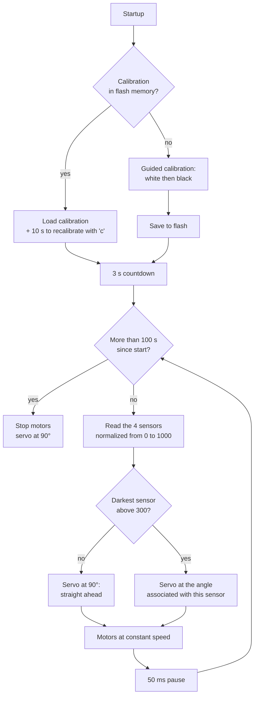

# 🏎️ Autonomous Line-Following Car (inspired by the NXP Cup)


> Side view of the car once mechanical and electronic assembly was completed.
## 📖 Overview

This project was carried out as part of the 3rd-year project at Polytech Dijon, by a team of three students. We wanted to build skills in embedded electronics and programming, and to discover 3D printing. The NXP Cup inspired us with a concrete goal: building an autonomous car able to follow a line on the ground.

The **NXP Cup** is an international competition organized by NXP Semiconductors, in which teams of students design, build, and program an autonomous miniature vehicle that races around a track as fast as possible. In the official 2025-2026 kit, the car is built on a 3D-printed chassis, driven by an NXP microcontroller, and guided by a camera. More information is available on the [official NXP Cup website](https://nxpcup.nxp.com) and in its [technical GitBook](https://nxp.gitbook.io/nxp-cup).

Rather than using an NXP board, we chose to take on the challenge our own way: we kept the mechanical base of the official kit (motors, servo, wheels, 3D-printed chassis adapted from NXP's files) and redesigned the rest around an **ESP32**.

## 👥 Team

Project carried out by a team of three, as part of the 3rd-year project at Polytech Dijon.

| Member | LinkedIn |
|---|---|
| GUENIAT Anice | [linkedin.com/in/anice-guéniat](https://www.linkedin.com/in/anice-gu%C3%A9niat/) |
| PORTAZ-MONCAYOLA Théo | [linkedin.com/in/theo-portaz-moncayola](https://www.linkedin.com/in/theo-portaz-moncayola/) |
| TENA-FRANCIA Baptiste | [linkedin.com/in/baptiste-tenafrancia](https://www.linkedin.com/in/baptiste-tenafrancia/) |


## 🆚 Official NXP Cup vs. our car

We kept the mechanical base of the official kit and replaced the electronic components that drive the car.

| | Official kit (2025-2026 edition) | Our car |
|---|---|---|
| Control board | NXP board (FRDM-MCXN947, FRDM i.MX93, or S32K144) | ESP32-DevKitC + expansion board |
| Line detection | Pixy2 camera | 5-channel infrared sensor module (TCRT5000) |
| Propulsion | 2 × JGA25-370 motors + DRV8833 drivers | Identical |
| Steering | MG996R servo | Identical |
| Wheels and guidance | 65 mm tires, 12 mm hex couplers, 626ZZ bearing | Identical |
| Power supply | 2S LiPo battery + LM2596 regulators | 5 × AA batteries (motors) + external USB-C battery (electronics) |
| Chassis | 3D-printed (files published by NXP) | 3D-printed from adapted NXP files (see below) |
| Software | NXP tools and examples | C++ (Arduino framework) with PlatformIO |

**Modifications made to the chassis** (based on the 3D files published by NXP):

- Removed the camera mount, no longer needed with infrared sensors
- Added mounts for our components: ESP32 with its expansion board and battery holder
- Added an extension to attach the infrared sensor module, with adjustable height above the ground and distance from the car


## 📸 Demonstration

<p align="center">
  <br>
  <em>The car autonomously follows the black line, including curves (top view, about 8 seconds).</em>
</p>

## ✨ Features

- Black line detection using a 5-channel infrared sensor module (TCRT5000)
- Black/white sensor calibration, **saved to flash memory** (no need to recalibrate at every power-up)
- Steering handled by a servo motor
- Propulsion by two geared motors driven through an H-bridge (DRV8833)
- Fully autonomous operation on batteries, with no connection to a computer

## 🔧 Hardware used

| Component | Role |
|---|---|
| ESP32-DevKitC (ESP-WROOM-32) + expansion board | The car's brain: reads the sensors and drives the actuators |
| 5-channel infrared line-following module (TCRT5000) | Detection of the black line on the ground (4 channels used) |
| DRV8833 motor driver (H-bridge) | Controls the speed and direction of the two motors |
| MG996R servo motor | Steering: turns the front wheels |
| 2 × JGA25-370 motors (6 V, 625 rpm) | Propulsion |
| 65 mm tires and 12 mm hex couplers | Wheels and mounting on the motor shafts |
| 626ZZ bearings | Rotation of the front wheels |
| 5 × AA battery holder | Power supply for the motors |
| External USB-C battery | Power supply for the electronics (ESP32, sensors, servo) |
| Breadboard and jumper wires | Wiring |
| 3D-printed chassis (adapted NXP files) | Mechanical structure |

**Software**: VS Code + PlatformIO, Arduino framework for ESP32.

## ⚡ Pinout (ESP32 GPIO)


 <!--
| GPIO | Function |
|---|---|
| 25 | DRV8833 — IN1 (motor A) |
| 26 | DRV8833 — IN2 (motor A) |
| 27 | DRV8833 — IN3 (motor B) |
| 14 | DRV8833 — IN4 (motor B) |
| 18 | Servo motor — PWM signal |
| 34 | IR sensor 1 |
| 35 | IR sensor 2 |
| 39 (SVN) | IR sensor 4 |
| 4 | IR sensor 5 |
 -->
> The module's center channel (sensor 3) proved unreliable during the project: it is not used, and the code relies on the 4 remaining channels (1, 2, 4, and 5).
>
> The four DRV8833 inputs receive PWM signals (1 kHz, 8-bit resolution) generated by the ESP32's LEDC peripheral.

## 🧠 How it works
The program (`code/src/main.cpp`) runs in two stages: a startup phase, followed by a decision loop repeated about 20 times per second. The diagram below summarizes how the program works.




## 🚧 Challenges encountered

- **Fried ESP32**: a mix-up between the 5 V and 3.3 V pins caused short circuit on a board. A multimeter helped us trace the cause of the failure.
- **Insufficient power supply**: the servo motor, the ESP32, and the sensors did not work properly when powered by a single regulated source. We split the power into two supplies: batteries for power (motors) and an external battery for the logic.
- **Unstable center channel on the module**: we gave up using it and adapted the decision algorithm to the 4 remaining channels.
- **Faulty servo motor**: on arrival, one of the servo's gear teeth was defective. We attempted to repair it without success, then ordered a new servo.
- **Broken motor mount**: a 3D-printing defect caused the motor mount to fail on the chassis. We reprinted the part with more robust print settings.

## 🗂️ Repository structure

```
voiture-nxp-cup-esp32/
├── README.md             
├── README.fr.md                  # French readme
├── code/                         # Main code: sensor reading, calibration, control loop
├── cad/                          # 3D Files
└── assets/                       # Pictures

```


## 🚀 Summary and outlook

This project took us through every stage of designing an embedded system: choosing and assembling components, adapting a 3D-printed mechanical structure, programming a microcontroller, and then diagnosing failures, whether from the electronics, the power supply, or a faulty part. The result is a car that follows a line autonomously, and above all a solid foundation to keep building on: finer driving control, speed better adapted to the trajectory, and smarter behavior in unexpected situations are the next steps we're looking forward to.
