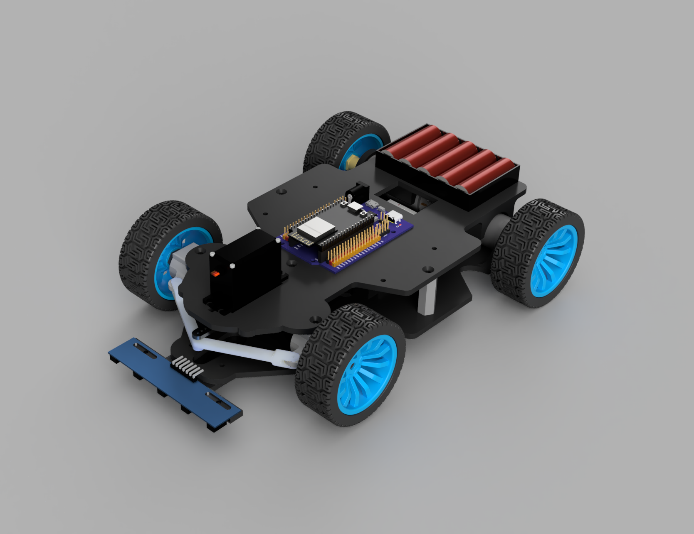

# 3D Design – NXP Cup ESP32 Car

This folder contains all the 3D design (CAD) files for the car, created with **Autodesk Fusion 360**.

## Preview



## Folder structure

```
cad/
├── README.md                # This file
├── source/                  # Editable Fusion 360 files (.f3d)
├── step/                    # Universal export (.step)
├── stl/                     # Parts ready for 3D printing
└── renders/                 # Render images
```

| Folder | Content | Purpose |
|---|---|---|
| `source/` | `voiture_complete.f3d` | Original file, editable in Fusion 360 |
| `step/` | `voiture_complete.step` | Neutral format, can be opened with FreeCAD, SolidWorks, Onshape, etc. |
| `stl/` | One part per file | Direct 3D printing, without opening Fusion |
| `renders/` | PNG images | Project presentation |


## Parts list

| Part | STL file | Quantity | Role |
|---|---|---|---|
| Bottom plate | `BottomPlate_Bottomplate.stl` | 1 | Base of the chassis, on which the components are mounted |
| Top plate | `plaque_hautV3.stl` | 1 | Upper deck of the chassis |
| Hex spacer | `Chassis_HexSpacer.stl` | 5 | Keeps the two chassis plates apart |
| Left steering arm | `Arm Steering left.stl` | 1 | Steering arm for the front left wheel |
| Right steering arm | `Arm steering right.stl` | 1 | Steering arm for the front right wheel |
| Front wheel hex adapter | `Steering_HexAdapterFrontWh….stl` | 2 | Connects the front wheel to its axle |
| Steering linchpin | `Steering_Linchpin.stl` | 2 | Locks the steering axle in place |
| Steering shaft | `Steering_SteerShaft.stl` | 2 | Pivot axle of the steering |
| Sensor mount | `support capteur.stl` | 1 | Sensor mounting bracket |
| Mount | `support.stl` | 1 | Bracket used to attach components to the chassis |


## Usage

### Editing the design
1. Open Fusion 360.
2. Go to `File > Open > Open from my computer`.
3. Select `source/voiture_complete.f3d`.

### Using another CAD software
Import the file `step/voiture_complete.step` (FreeCAD, SolidWorks, Onshape, etc.).

### Printing a part
Open the desired `.stl` file in your slicer (Cura, PrusaSlicer, Bambu Studio...) and start the print.
